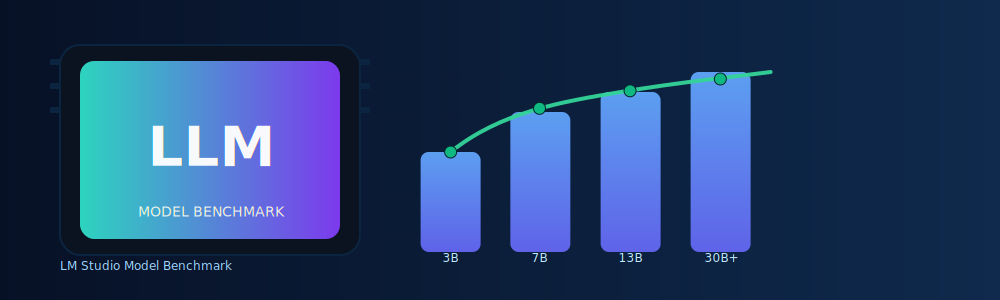

# LM Studio Model Benchmark



Automatic benchmarking tool for all locally installed LM Studio models. Systematically tests different models and
quantizations to measure and compare tokens-per-second performance.

[](LICENSE)
[](https://www.python.org/downloads/)
[](https://www.linux.org/)
[](https://lmstudio.ai/download)
[](https://lmstudio.ai)
[](https://github.com/Ajimaru/LM-Studio-Bench/releases/latest)
[](https://github.com/Ajimaru/LM-Studio-Bench/releases)

## Table of Contents

- [Features](#features)
- [System Requirements](#system-requirements)
- [Installation](#installation)
- [Usage](#usage)
- [Customization](#customization)
- [Output](#output)
- [Measured metrics](#measured-metrics)
- [Technical Details](#technical-details)
- [Troubleshooting](#troubleshooting)
- [Documentation](#documentation)
- [Support](#support)
- [Contributing](#contributing)
- [Code of Conduct](#code-of-conduct)
- [Security](#security)
- [Project Meta](#project-meta)
- [License](#license)
- [Third-party licenses](#third-party-licenses)

## Features

- 🌐 **Web Dashboard**: Modern FastAPI-based web UI with live streaming, dark mode and an interactive results browser
  - 🏠 **Dashboard Home**:
    - System info (OS, kernel, CPU, GPU with detailed model names)
    - LM Studio healthcheck status
    - Executive summary KPIs (avg, P50, P95 speed)
    - Top 5 fastest models
    - Last 10 benchmark runs
  - ⚡ **Live Streaming**: WebSocket for real-time terminal output
  - 🎮 **Benchmark Control**: Start/stop via web interface
  - 🖱️ **Linux Tray Control**: Status icon + Start/Pause/Stop/Quit controls
    - Dynamic status icon: gray (idle), green (running), yellow (paused)
    - Error state icon: red when API is unreachable
    - Smart button states with automatic 3-second status polling
  - 📊 **Results Browser**: Browse all cached benchmark results
    - 📥 **Export Functions**: Download JSON/CSV/PDF/HTML reports
      - 🗂️ JSON, CSV (Excel/Sheets compatible)
      - 📄 PDF (multi-page with best-practice recommendations, vision/tool/architecture pages, optional Plotly charts)
      - 🌐 HTML (interactive Plotly charts, best-practices, vision/tool/architecture tables, dark mode)
    - ⚡ **Instant Report Regeneration**: `--export-only` generates reports from cached data in <1s
  - 🌐 **Network Access**: Reachable from other devices on your network
  - 📝 **Separate Logs**:
    `~/.local/share/lm-studio-bench/logs/webapp_*.log` and
    `~/.local/share/lm-studio-bench/logs/benchmark_*.log`
  - ⚙️ **Parameter Configuration**: All CLI parameters available via GUI
    - All CLI arguments available
    - Tooltip explanations for all options
    - Preset Management (load/save/delete/compare)
    - Preset ZIP export/import
    - Filters by quantization, architecture, parameter size, context length
    - Sort by speed, efficiency, TTFT or VRAM
    - Hardware limits (max GPU temp, max power)
    - GTT options (AMD GPUs)
- 🔌 **LM Studio REST API v1 Support**: Native integration with `/api/v1/*` endpoints
- 🤖 **Automatic Model Discovery**: Finds all locally installed models and quantizations
- 🎮 **GPU Detection**: Detailed GPU detection for NVIDIA, AMD and Intel GPUs
  - NVIDIA: GPU model via `nvidia-smi --query-gpu=name`
  - AMD: GPU series via `lspci` device-ID mapping, `rocm-smi`, or gfx code
  - iGPU extraction from CPU string (e.g. "Radeon 890M")
- 📊 **Live Hardware Monitoring**: 6 interactive charts (GPU temp, power, VRAM, GTT, CPU, system RAM) with
  stats
  - 💾 **VRAM Monitoring**: Measures VRAM usage during benchmarks
  - 🧠 **GTT Support (AMD)**: Uses shared system RAM in addition to VRAM (e.g. 2GB VRAM + 46GB GTT =
    48GB)
  - 🖥️ **System Profiling**: CPU and RAM usage with `--enable-profiling`
  - 🌡️ **Hardware Profiling**: Optional monitoring of GPU temperature and power draw (NVIDIA/AMD/Intel)
  - 📥 **Export Buttons**: Quick access to the latest HTML/PDF/JSON/CSV benchmark results
- 🔄 **Progressive GPU Offload**: Automatically tries different GPU offload levels (1.0 → 0.7 → 0.5 → 0.3)
- 🖥️ **Server Management**: Starts LM Studio server automatically if needed
- 📝 **Standardized Tests**: Uses the same prompt for all models
- 📈 **Statistical Evaluation**: Warmup + multiple measurements for accurate results
- 🗄️ **SQLite Cache**: Automatically caches benchmark results (skips already-tested models)
  - Automatic schema migration for newly added benchmark columns
- 🔁 **Resilient Inference**: Retries once when LM Studio reports
  transient "Model unloaded"
- ⚡ **Dev Mode**: Picks the smallest model for quick tests during development
- 🧹 **Clean Logging**: Emojis, formatted model lists, filtered third-party debug logs, separate log files for
  webapp and benchmarks
- 🏷️ **Extensive Metadata**: parameter size, architecture, context length, file size, vision and tool support
- **🎨 27 Themes**: Light, Dark, Ocean Blue, Deep Slate, Mint Green, Speed Red, Neon Purple, Solarized
  Dark/Light, Gruvbox, Dracula, Nord, Monokai, Paper, Terminal Green, OLED, Forest, Sunset, Cyberpunk, Pastel,
  Sepia, 80s, 90s, Hacker/Matrix, Hardware

## System Requirements

- **OS**: Linux (primary), macOS (untested), Windows (untested)
- **Python**: 3.10 or newer
- **GPU**: ~12GB VRAM recommended (NVIDIA/AMD/Intel)
- **Software**: [LM Studio](https://lmstudio.ai/) or
  [LM Studio (Headless)](https://lmstudio.ai/docs/developer/core/headless_llmster/) installed locally

## Installation

### Option 1: Use the AppImage

Download `LM-Studio-Bench-x86_64.AppImage` from the latest release,
make it executable, and start it:

```bash
chmod +x LM-Studio-Bench-x86_64.AppImage

# Tray-only mode (default — no args)
./LM-Studio-Bench-x86_64.AppImage

# Web dashboard mode
./LM-Studio-Bench-x86_64.AppImage --webapp
```

Notes:

- No repository clone or Python setup is required for the AppImage.
- LM Studio still needs to be installed on the host system.
- The `lms` CLI must be available in `PATH`.
- **Running without arguments** starts only the system tray icon.
  Use `--webapp` or any benchmark flag to launch the full application.

<!-- markdownlint-disable MD033 -->
<details>
<summary><strong>Option 2. Clone with Git and install with setup.sh</strong></summary>

#### 1. Clone the repository

```bash
git clone <repository-url>
cd LM-Studio-Bench
```

#### 2. Prepare your system with `setup.sh`

```bash
# Preview what setup would do (no changes)
./setup.sh --dry-run

# Interactive setup
./setup.sh
```

The setup script checks and prepares:

- Linux system dependencies (package-manager aware)
- GPU tooling (`nvidia-smi`, `rocm-smi`, `intel_gpu_top` when available)
- LM Studio / llmster availability
- Python virtual environment (`.venv`)
- Python dependencies from `requirements.txt`

#### 3. Activate the virtual environment

```bash
# Activate (Linux/macOS)
source .venv/bin/activate

# Activate (Windows)
.venv\Scripts\activate.bat
```

#### 4. Manual fallback (if you skip `setup.sh`)

Install system dependencies (Linux, tray support):

```bash
# Ubuntu/Debian
sudo apt install python3-dev libgirepository1.0-dev libcairo2-dev pkg-config

# Fedora/RHEL
sudo dnf install python3-devel gobject-introspection-devel cairo-devel pkg-config

# Arch
sudo pacman -S python gobject-introspection cairo pkgconf
```

Install Python dependencies:

```bash
python3 -m venv .venv
source .venv/bin/activate
pip install -r requirements.txt
```

#### 5. Check LM Studio CLI

```bash
lms --help
```

</details>
<!-- markdownlint-enable MD033 -->

## Usage

The AppImage is the preferred way to use LM-Studio-Bench.
All examples below use `LM-Studio-Bench-x86_64.AppImage`.
The same CLI options also work with `./run.py`.

### 🔔 System Tray (quick access)

Launching the AppImage **without any arguments** starts only the system tray
icon. The tray stays in the panel until you quit it via its menu.

```bash
./LM-Studio-Bench-x86_64.AppImage
```

Add `--debug` / `-d` to enable verbose tray logging while still staying in
tray-only mode.

### 🌐 Web Dashboard

Start the modern web UI with live streaming and an interactive results browser:

```bash
# Start the web dashboard (opens browser automatically)
./LM-Studio-Bench-x86_64.AppImage --webapp
```

1. Check/start LM Studio server
2. Discover all installed models
3. Test each model with a standardized prompt
4. Save results to `~/.local/share/lm-studio-bench/results/`

### CLI Options

#### Basic parameters

<!-- markdownlint-disable MD033 -->

<details>
<summary>click to expand</summary>

```bash
./LM-Studio-Bench-x86_64.AppImage --runs 1
./LM-Studio-Bench-x86_64.AppImage --context 4096
./LM-Studio-Bench-x86_64.AppImage --prompt "..."
./LM-Studio-Bench-x86_64.AppImage --limit 5
```

</details>

#### Preset management

<details>
<summary>click to expand</summary>

```bash
# Show all available presets (readonly + user)
./LM-Studio-Bench-x86_64.AppImage --list-presets

# Load preset (default is loaded if omitted)
./LM-Studio-Bench-x86_64.AppImage --preset quick_test

# Load preset and override individual values
./LM-Studio-Bench-x86_64.AppImage --preset high_quality --runs 3 --context 4096

# Prompt short flag is -P (because -p is used for --preset)
./LM-Studio-Bench-x86_64.AppImage --preset default -P "Explain machine learning in 3 sentences"
```

Built-in readonly presets:

- `default`
- `quick_test`
- `high_quality`
- `resource_limited`

</details>

#### REST API Mode (LM Studio 0.4.0+)

<details>
<summary>click to expand</summary>

```bash
# Use REST API v1 instead of SDK/CLI
./LM-Studio-Bench-x86_64.AppImage --use-rest-api --limit 1

# With API authentication
./LM-Studio-Bench-x86_64.AppImage --use-rest-api --api-token "lms_your_token" --limit 1

# With parallel inference (continuous batching)
./LM-Studio-Bench-x86_64.AppImage --use-rest-api --n-parallel 8 --unified-kv-cache --limit 1

# Filter by capabilities
./LM-Studio-Bench-x86_64.AppImage --use-rest-api --only-vision
./LM-Studio-Bench-x86_64.AppImage --use-rest-api --only-tools
```

See [REST API Features](docs/REST_API_FEATURES.md) for full documentation.

</details>

### Hardware profiling

<details>
<summary>click to expand</summary>

```bash
# Enable GPU monitoring (temperature + power draw)
./LM-Studio-Bench-x86_64.AppImage --enable-profiling

# With safety limits
./LM-Studio-Bench-x86_64.AppImage --enable-profiling --max-temp 85 --max-power 350

# AMD GTT (shared system RAM)
./LM-Studio-Bench-x86_64.AppImage --disable-gtt
```

</details>

### Advanced filters

<details>
<summary>click to expand</summary>

```bash
# Specific quantizations only
./LM-Studio-Bench-x86_64.AppImage --quants q4,q5

# Specific architectures only
./LM-Studio-Bench-x86_64.AppImage --arch llama,mistral

# Specific parameter sizes only
./LM-Studio-Bench-x86_64.AppImage --params 3B,7B

# Vision models only
./LM-Studio-Bench-x86_64.AppImage --only-vision

# Tool-capable models only
./LM-Studio-Bench-x86_64.AppImage --only-tools

# Minimum context length
./LM-Studio-Bench-x86_64.AppImage --min-context 32000

# Maximum model size (GB)
./LM-Studio-Bench-x86_64.AppImage --max-size 10.0

# Regex filter: include (only models that match)
./LM-Studio-Bench-x86_64.AppImage --include-models "qwen|phi"
./LM-Studio-Bench-x86_64.AppImage --include-models "llama.*7b"
./LM-Studio-Bench-x86_64.AppImage --include-models ".*q4.*"

# Regex filter: exclude (exclude models)
./LM-Studio-Bench-x86_64.AppImage --exclude-models "uncensored"
./LM-Studio-Bench-x86_64.AppImage --exclude-models "q2|q3"
./LM-Studio-Bench-x86_64.AppImage --exclude-models ".*vision.*"

# Combine filters (AND semantics)
./LM-Studio-Bench-x86_64.AppImage --include-models "llama" --exclude-models "q2" --only-tools
./LM-Studio-Bench-x86_64.AppImage --only-vision --params 7B --max-size 12
```

</details>

### Cache management

<details>
<summary>click to expand</summary>

```bash
# Use cache (default - skips already-tested models)
./LM-Studio-Bench-x86_64.AppImage --limit 5

# Ignore cache and retest everything
./LM-Studio-Bench-x86_64.AppImage --retest --limit 5

# Development mode (smallest model, 1 run)
./LM-Studio-Bench-x86_64.AppImage --dev-mode

# Show all cached results
./LM-Studio-Bench-x86_64.AppImage --list-cache

# Export cache as JSON
./LM-Studio-Bench-x86_64.AppImage --export-cache my_cache.json

# Generate reports from the database (no new tests)
./LM-Studio-Bench-x86_64.AppImage --export-only
./LM-Studio-Bench-x86_64.AppImage --export-only --params 7B
./LM-Studio-Bench-x86_64.AppImage --export-only --quants q4
./LM-Studio-Bench-x86_64.AppImage --export-only --compare-with latest
```

</details>

<!-- markdownlint-enable MD033 -->

### Default settings

<!-- markdownlint-disable MD033 -->

<details>
<summary>click to expand</summary>

- **Prompt**: "Is the sky blue?"
- **Context length**: 2048 tokens
- **Warmup**: 1 run
- **Measurements**: 3 runs
- **GPU offload**: automatic (1.0 → 0.7 → 0.5 → 0.3)

</details>

<!-- markdownlint-enable MD033 -->

### Optimized inference parameters

<!-- markdownlint-disable MD033 -->

<details>
<summary>click to expand</summary>

For standardized and reproducible benchmarks the following sampling parameters are used:

| Parameter           | Value | Reason                                                     |
|---------------------|-------|----------------------------------------------------------- |
| **Temperature**     | 0.1   | Low for consistent, near-deterministic outputs             |
| **Top-K Sampling**  | 40    | Sample from top 40 tokens                                  |
| **Top-P Sampling**  | 0.9   | Nucleus sampling with 90% cumulative probability           |
| **Min-P Sampling**  | 0.05  | Minimum probability threshold                              |
| **Repeat Penalty**  | 1.2   | Reduces repetitions (default 1.1)                          |
| **Max Tokens**      | 256   | Bounded output length for faster tests                     |

</details>

<!-- markdownlint-enable MD033 -->

## Customization

For persistent changes edit the configuration file [config/defaults.json](config/defaults.json). This file
controls the default `prompt`, `context_length`, `num_runs`, and other inference parameters used by the
benchmark.

For ad-hoc runs you can override defaults on the command line. Example:

```bash
./run.py -P "Your custom test prompt" --context 4096 --runs 5
```

(See [config/defaults.json](config/defaults.json) for persistent configuration.)

## Output

### Log files

<!-- markdownlint-disable MD033 -->

<details>
<summary>click to expand</summary>

The tool uses separate log files for different components:

```text
logs/
├── webapp_20260105_112201.log       # Web dashboard logs (only when --webapp is used)
└── benchmark_20260105_113045.log    # Benchmark run logs
```

- **WebApp logs** (`webapp_*.log`): FastAPI server, WebSocket events, HTTP requests
- **Benchmark logs** (`benchmark_*.log`): model tests, VRAM monitoring, errors
- Logs are only created when the corresponding component is active
- Timestamps use the format `YYYYMMDD_HHMMSS`

</details>

<!-- markdownlint-enable MD033 -->

### Result files

<!-- markdownlint-disable MD033 -->

<details>
<summary>click to expand</summary>

Benchmark reports are stored in the `results/` directory:

- `benchmark_results_YYYYMMDD_HHMMSS.json` - structured data (for automation)
- `benchmark_results_YYYYMMDD_HHMMSS.csv` - tabular data (Excel/Sheets compatible)
- `benchmark_results_YYYYMMDD_HHMMSS.pdf` - formatted report (share/archive)
- `benchmark_results_YYYYMMDD_HHMMSS.html` - interactive Plotly charts
- `benchmark_cache.db` - SQLite database with all benchmark results (automatic caching)

**Note:** Reports contain only the **newly tested models** from the current run. The interactive results browser
in the web dashboard shows all cached results for historical comparisons.

</details>

<!-- markdownlint-enable MD033 -->

### PDF report

<!-- markdownlint-disable MD033 -->

<details>
<summary>click to expand</summary>

The PDF report is generated in **A4 landscape** and includes:

- **Summary**: benchmark configuration (number of models, context length, prompt)
- **Detailed table**: all metrics including metadata (parameter size, architecture, file size)
- **Visual indicators**: emoji icons for vision capability (👁) and tool support (🔧)
- **Performance stats**: fastest/slowest model, averages
- **Best practices**: recommendations based on the results (e.g. "Use Q4 quantization for 7B models for best
  speed/quality balance")
- **Model-specific insights**: notes on specific models (e.g. "Llama 3.2 3B shows excellent performance with
  Q4_K_M quantization, achieving 51.43 tokens/s with a TTFT of 0.111s")
- **Hardware profiling charts**: if `--enable-profiling` is used, includes GPU temperature and power draw
  charts for each model

</details>

<!-- markdownlint-enable MD033 -->

### Example CSV output

<!-- markdownlint-disable MD033 -->

<details>
<summary>click to expand</summary>

```csv
model_name,quantization,gpu_type,gpu_offload,vram_mb,avg_tokens_per_sec,avg_ttft,avg_gen_time,prompt_tokens,completion_tokens,timestamp,params_size,architecture,max_context_length,model_size_gb,has_vision,has_tools,tokens_per_sec_per_gb,tokens_per_sec_per_billion_params
llama-3.2-3b-instruct,q4_k_m,NVIDIA,1.0,2048,51.43,0.111,0.954,10,49,2026-01-04 10:30:45,3B,llama,8192,1.92,False,False,26.79,17.14
qwen2.5-7b-instruct,q5_k_m,NVIDIA,0.7,4512,38.76,0.145,1.287,10,49,2026-01-04 10:35:12,7B,qwen,131072,4.38,False,True,8.85,5.54
```

</details>

<!-- markdownlint-enable MD033 -->

### Logs

<!-- markdownlint-disable MD033 -->

<details>
<summary>click to expand</summary>

- **Console**: real-time progress with a `tqdm` progress bar and emoji icons
  - 🚀 Start/Launch
  - 🔍 Detection/Discovery
  - 📊 Data/Statistics
  - 💾 Storage/Memory
  - ✅ Success/Completion
  - 🎯 Optimization
  - ⚙️ Configuration
  - ⏱️ Time/Performance
  - Additional icons for specific operations
- **Per-run logs**:
  `~/.local/share/lm-studio-bench/logs/benchmark_YYYYMMDD_HHMMSS.log`
  - separate log file per run
- **Filtered logs**: third-party libraries (httpx, lmstudio, urllib3, websockets) are limited to WARNING level
- **JSON filtering**: WebSocket debug events are automatically filtered

</details>

<!-- markdownlint-enable MD033 -->

## Measured metrics

<!-- markdownlint-disable MD033 -->

<details>
<summary>click to expand</summary>

| Metric | Description |
| ------ | ----------- |
| **avg_tokens_per_sec** | Average token generation speed |
| **avg_ttft** | Time to First Token - latency until the first generated token |
| **avg_gen_time** | Total time for generating the response |
| **vram_mb** | VRAM usage during inference (if measurable) |
| **prompt_tokens** | Number of input tokens |
| **completion_tokens** | Number of generated tokens |
| **params_size** | Model parameter size (e.g. "3B", "7B") |
| **architecture** | Model architecture (e.g. "mistral3", "gemma3") |
| **max_context_length** | Maximum context length of the model in tokens |
| **model_size_gb** | Model file size in GB (rounded to 2 decimals) |
| **has_vision** | Vision capability (multimodal: text + images) |
| **has_tools** | Tool-calling support (function/tool use) |
| **tokens_per_sec_per_gb** | Efficiency: tokens/s per GB of model size |
| **tokens_per_sec_per_billion_params** | Efficiency: tokens/s per billion parameters |
| **temp_celsius_min/max/avg** | GPU temperature during the benchmark (°C) - only with `--enable-profiling` |
| **power_watts_min/max/avg** | GPU power draw during the benchmark (W) - only with `--enable-profiling` |

</details>

<!-- markdownlint-enable MD033 -->

## Technical Details

### GPU Detection

<!-- markdownlint-disable MD033 -->

<details>
<summary>click to expand</summary>

The tool searches for GPU monitoring tools in:

- Standard PATH
- `/usr/bin`
- `/usr/local/bin`
- `/opt/rocm/bin` (AMD)
- `/usr/lib/xpu` (Intel)

</details>

<!-- markdownlint-enable MD033 -->

### GPU Offload Strategy

<!-- markdownlint-disable MD033 -->

<details>
<summary>click to expand</summary>

If loading fails, offload is automatically reduced:

1. 🟢 `gpuOffload: 1.0` (100% GPU)
2. 🟡 `gpuOffload: 0.7` (70% GPU)
3. 🟠 `gpuOffload: 0.5` (50% GPU)
4. 🔴 `gpuOffload: 0.3` (30% GPU)
5. ❌ Error → Skip model + log

</details>

<!-- markdownlint-enable MD033 -->

### REST API Endpoints

<!-- markdownlint-disable MD033 -->

<details>
<summary>click to expand</summary>

- `GET /` - Dashboard UI
- `GET /api/status` - Benchmark status
- `GET /api/output` - Terminal output
- `POST /api/benchmark/start` - Start benchmark
- `POST /api/benchmark/pause` - Pause
- `POST /api/benchmark/resume` - Resume
- `POST /api/benchmark/stop` - Stop
- `POST /api/system/shutdown` - Graceful full app shutdown
- `WS /ws/benchmark` - WebSocket live streaming

</details>

<!-- markdownlint-enable MD033 -->

## Troubleshooting

### "lms: command not found"

<!-- markdownlint-disable MD033 -->

<details>
<summary>click to expand</summary>

The LM Studio CLI is not in your PATH. Install or configure LM Studio:

```bash
# Check installation
which lms
```

</details>

### "No models found"

<!-- markdownlint-disable MD033 -->

<details>
<summary>click to expand</summary>

Ensure models are downloaded in LM Studio:

```bash
lms ls
```

</details>

### "GPU monitoring not available"

<!-- markdownlint-disable MD033 -->

<details>
<summary>click to expand</summary>

GPU tooling is missing. Install the appropriate tools for your GPU:

**NVIDIA**:

```bash
sudo apt install nvidia-utils
```

**AMD**:

```bash
sudo apt install rocm-dkms rocm-smi
```

**Intel**:

```bash
sudo apt install intel-gpu-tools
```

</details>

### Model fails to load (VRAM error)

<!-- markdownlint-disable MD033 -->

<details>
<summary>click to expand</summary>

The script will automatically try lower GPU offload levels. With ~12GB VRAM:

- ✅ 3B models with Q5_K_M
- ✅ 7B models with Q4_K_M
- ⚠️ 13B models with Q3_K_M (possible)
- ❌ 32B+ models (not recommended)

</details>

### Log Files and Output

<!-- markdownlint-disable MD033 -->

<details>
<summary>click to expand</summary>

The benchmark tool generates separate log files for each component:

**Log Locations**:

```text
~/.local/share/lm-studio-bench/logs/
├── benchmark_YYYYMMDD_HHMMSS.log    # Benchmark execution logs
└── webapp_YYYYMMDD_HHMMSS.log       # Web dashboard logs
```

**Log Format**:

```bash
2026-03-06 10:15:30,123 - INFO - Starting benchmark...
YYYY-MM-DD HH:MM:SS,mmm - LEVEL - message
```

**Log Levels**:

- `INFO`: General information, progress updates, hardware metrics
- `WARNING`: Non-fatal issues (GPU tool missing, falling back to CLI)
- `ERROR`: Runtime errors (model load failure, API unavailable)

**Third-Party Logging**:

The following libraries have suppressed debug output for clarity:

- `httpx` - HTTP client (set to WARNING)
- `lmstudio` - LM Studio SDK (set to WARNING)
- `urllib3` - HTTP library (set to WARNING)
- `websockets` - WebSocket protocol (set to WARNING)

**Viewing Logs**:

```bash
# View latest benchmark log (real-time)
tail -f ~/.local/share/lm-studio-bench/logs/benchmark_*.log

# View latest webapp log
tail -f ~/.local/share/lm-studio-bench/logs/webapp_*.log

# Search for errors
grep ERROR ~/.local/share/lm-studio-bench/logs/benchmark_*.log

# Check hardware metrics in logs
grep "💾\|🌡️\|⚡" \
  ~/.local/share/lm-studio-bench/logs/benchmark_*.log
```

**Hardware Metrics in Logs**:

Hardware monitoring data is logged with emoji indicators:

```text
🌡️ GPU Temp: 42°C
⚡ GPU Power: 125W
💾 GPU VRAM: 8.2GB
🧠 GPU GTT: 0.0GB
🖥️ CPU: 35.2%
💾 RAM: 18.5GB
```

</details>

## Documentation

Comprehensive guides and references:

- 📖 [**Configuration Reference**](docs/CONFIGURATION.md) - All CLI arguments and config file options
- 🚀 [**Quickstart Guide**](docs/QUICKSTART.md) - Get started in 5 minutes
- 🏗️ [**Architecture Documentation**](docs/ARCHITECTURE.md) - System architecture with Mermaid diagrams
- 📂 [**User Data & Configuration**](docs/USER_DATA.md) - XDG directory structure and config management
- 🔌 [**REST API Features**](docs/REST_API_FEATURES.md) - Advanced REST API integration
- 🖥️ [**Hardware Monitoring Guide**](docs/HARDWARE_MONITORING_GUIDE.md) - GPU, CPU, RAM tracking
- 🏷️ [**LLM Metadata Guide**](docs/LLM_METADATA_GUIDE.md) - Model capabilities and metadata

[](https://github.com/Ajimaru/LM-Studio-Bench/actions/workflows/mdbook.yml)

## Support

If you encounter problems:

1. Check `~/.local/share/lm-studio-bench/logs/` for error logs
2. Make sure LM Studio is running
3. Open an issue with logs and system info

## Contributing

See [CONTRIBUTING.md](CONTRIBUTING.md) for development setup and PR guidance.

[](https://app.codacy.com/gh/Ajimaru/LM-Studio-Bench/dashboard?utm_source=gh&utm_medium=referral&utm_content=&utm_campaign=Badge_grade)
[](https://codecov.io/github/ajimaru/lm-studio-bench)
[](https://github.com/Ajimaru/LM-Studio-Bench/actions/workflows/ci.yml)

## Code of Conduct

Please review [CODE_OF_CONDUCT.md](CODE_OF_CONDUCT.md) before participating.

## Security

Report vulnerabilities via the process in [SECURITY.md](SECURITY.md).

[](https://github.com/Ajimaru/LM-Studio-Bench/actions/workflows/snyk-security.yml)
[](https://github.com/Ajimaru/LM-Studio-Bench/actions/workflows/bandit.yml)
[](https://github.com/Ajimaru/LM-Studio-Bench/actions/workflows/codeql.yml)

## Project Meta

- **[Changelog](CHANGELOG.md)** - Notable project changes by release
- **[Contributing Guide](CONTRIBUTING.md)** - How to contribute and validate changes
- **[Authors](AUTHORS)** - Project contributors displayed in the About dialog

[](https://github.com/Ajimaru/LM-Studio-Bench/commits/main)
[](https://github.com/Ajimaru/LM-Studio-Bench/issues)
[](https://github.com/Ajimaru/LM-Studio-Bench/graphs/contributors)

## License

This project is licensed under the MIT License. See [LICENSE](LICENSE).

## Third-party licenses

Dependency licensing details are listed in
[THIRD_PARTY_LICENSES.md](THIRD_PARTY_LICENSES.md).

---

[](https://github.com/Ajimaru/LM-Studio-Bench/stargazers)
[](https://github.com/Ajimaru/LM-Studio-Bench/network/members)
[](https://github.com/Ajimaru/LM-Studio-Bench/watchers)
[](https://europa.eu/)

**Note**: This tool is intended for development/testing. For production deployments, see the LM Studio documentation.
