# Architecture Documentation

<!-- markdownlint-disable MD033 MD046 -->

> Comprehensive architecture documentation with Mermaid diagrams showing how the Python modules interact and
> how CLI arguments and configuration files are processed.

---

## Table of Contents

- [Architecture Documentation](#architecture-documentation)
  - [Table of Contents](#table-of-contents)
  - [System Architecture Overview](#system-architecture-overview)
  - [Startup Flow](#startup-flow)
    - [AppImage Entry Point](#appimage-entry-point)
    - [run.py Flow](#runpy-flow)
  - [Setup Flow (Installation \& Configuration)](#setup-flow-installation--configuration)
  - [Tray Control Flow (Linux)](#tray-control-flow-linux)
  - [Tray Quit Sequence (Linux)](#tray-quit-sequence-linux)
  - [Configuration Loading](#configuration-loading)
  - [Configuration Priority](#configuration-priority)
  - [Benchmark Execution Flow](#benchmark-execution-flow)
  - [REST API vs SDK Mode](#rest-api-vs-sdk-mode)
  - [Component Details](#component-details)
    - [1. run.py (Entry Point)](#1-runpy-entry-point)
    - [2. config\_loader.py (Configuration Manager)](#2-config_loaderpy-configuration-manager)
    - [3. benchmark.py (Main Engine)](#3-benchmarkpy-main-engine)
    - [4. rest\_client.py (REST API Client)](#4-rest_clientpy-rest-api-client)
    - [5. tray.py (Linux Tray Controller)](#5-traypy-linux-tray-controller)
    - [6. web/app.py + dashboard.html.jinja (Dashboard Analytics)](#6-webapppy--dashboardhtmljinja-dashboard-analytics)
  - [Data Flow Summary](#data-flow-summary)
  - [Testing Architecture](#testing-architecture)
    - [Test Organization](#test-organization)
    - [Test Coverage by Component](#test-coverage-by-component)
    - [Testing Approach](#testing-approach)
  - [See Also](#see-also)

---

## System Architecture Overview

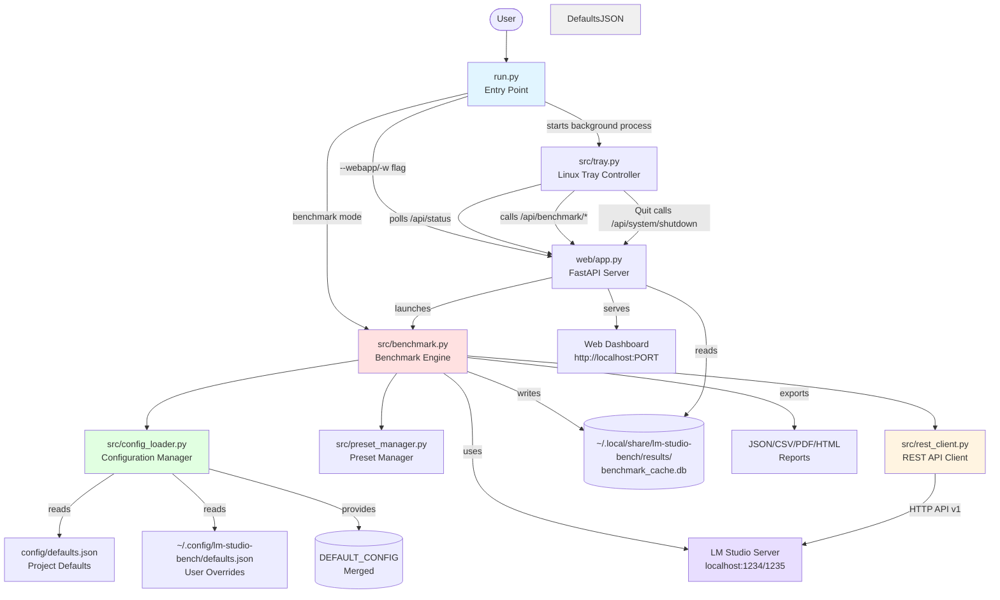

**Key Components:**

- **run.py**: Wrapper script that decides between web dashboard and CLI benchmark mode
- **benchmark.py**: Main benchmark engine (~4,683 lines) with argparse, model discovery, and execution
- **config_loader.py**: Loads and merges configuration from JSON file with built-in defaults
- **preset_manager.py**: Manages readonly/user presets and maps presets to CLI args
- **rest_client.py**: REST API client for LM Studio v1 endpoints (optional mode)
- **web/app.py**: FastAPI web dashboard with live streaming and results browser
- **tray.py**: Linux AppIndicator tray controller for benchmark controls

---

## Startup Flow

### AppImage Entry Point

When the AppImage is executed, the bundled `lmstudio-bench` shell script runs
**before** `run.py` and splits on whether real arguments are present:

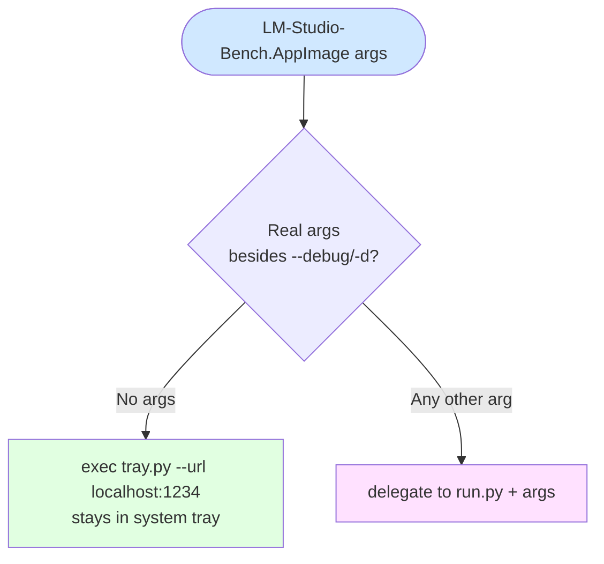

> `--debug` / `-d` is exempt: `./AppImage --debug` still enters tray-only mode
> with verbose logging.

### run.py Flow

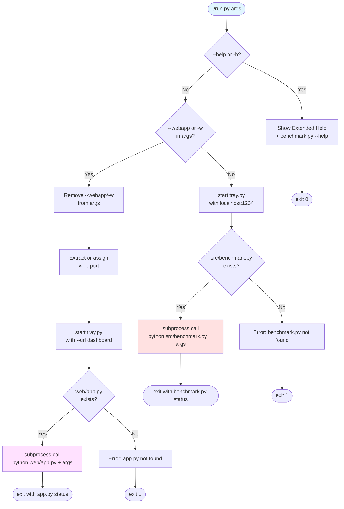

**Decision Logic (run.py):**

1. **Help Mode** (`--help`/`-h`): Displays extended help combining run.py explanation + benchmark.py CLI options
2. **Web Mode** (`--webapp`/`-w`): Launches tray + FastAPI dashboard on a free
   local port
3. **Benchmark Mode** (default): Launches tray + benchmark.py with all CLI
   arguments

**AppImage vs. run.py — default behaviour difference:**

| Invocation | No-argument default |
| --- | --- |
| `./LM-Studio-Bench.AppImage` | Tray-only (stays in panel, no benchmark) |
| `./run.py` | Tray + benchmark.py (runs full benchmark) |

---

## Setup Flow (Installation & Configuration)

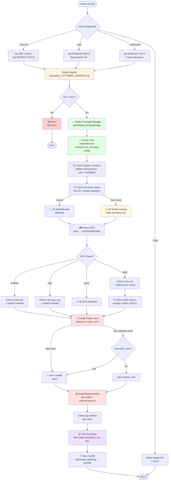

**Setup Flow Summary:**

1. **Parse Arguments**: Handle `--help`, `--dry-run`, `--yes`, `--interactive` flags
2. **Logging Setup**: Create timestamped log file in `logs/setup_YYYYMMDD_HHMMSS.log`
3. **Environment Checks**:
   - Verify Linux OS
   - Detect package manager (apt/dnf/pacman/zypper/apk)
   - Check core dependencies (Python 3, Git, curl, pkg-config)
   - Verify system libraries (gobject-introspection, cairo, PyGObject for tray support)

4. **LM Studio Stack**:
   - Check for `lms` CLI or `llmster` headless binary
   - Offer download link if missing

5. **GPU & Monitoring Tools**:
   - Detect GPU type via `lspci` (NVIDIA, AMD, Intel)
   - Install/check GPU-specific tools (`nvidia-smi`, `rocm-smi`, `intel_gpu_top`)
   - For AMD: Check drivers, ROCm, libdrm, X.Org AMDGPU driver

6. **Python Environment**:
   - Create virtual environment (`.venv/`)
   - Install Python dependencies from `requirements.txt`
   - Check for pip conflicts

7. **Summary**:
   - Print next steps for user:
     - Activate venv: `source .venv/bin/activate`
     - Run webapp: `python run.py --webapp`
     - Run CLI: `python run.py`
   - Log file symlink: `logs/setup_latest.log`

**Modes:**

| Mode | Behavior |
| ---- | -------- |
| `--help` | Show usage and exit |
| `--dry-run` | Preview all actions (no changes) |
| `--yes` | Non-interactive (auto-answer 'no' to optional prompts) |
| `--interactive` | Force interactive mode (default if TTY detected) |

---

## Tray Control Flow (Linux)

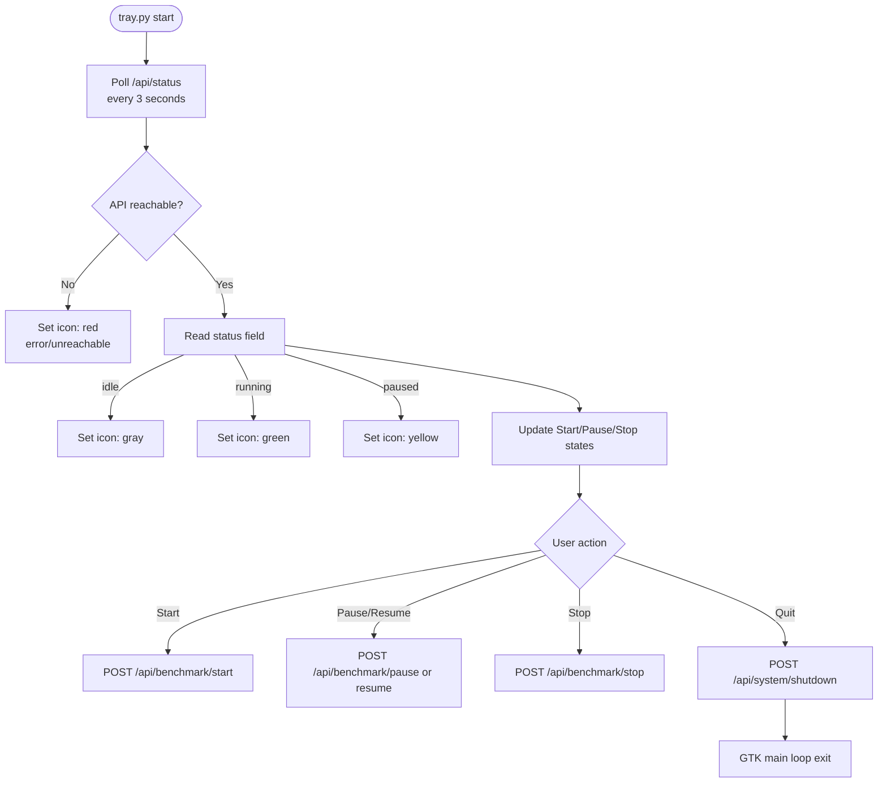

**Tray behavior summary:**

- Dynamic status icons: gray (idle), green (running), yellow (paused), red
  (API error/unreachable)
- Smart controls: Start enabled in idle/error, Pause and Stop enabled only in
  running or paused state
- Quit path: Tray triggers graceful shutdown endpoint, then exits

## Tray Quit Sequence (Linux)

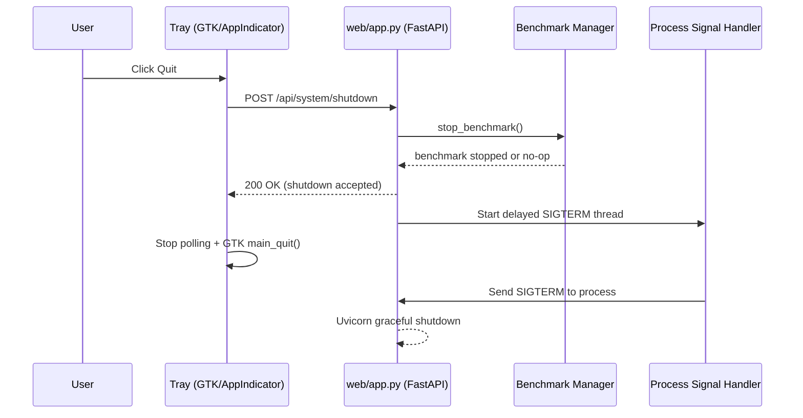

---

## Configuration Loading

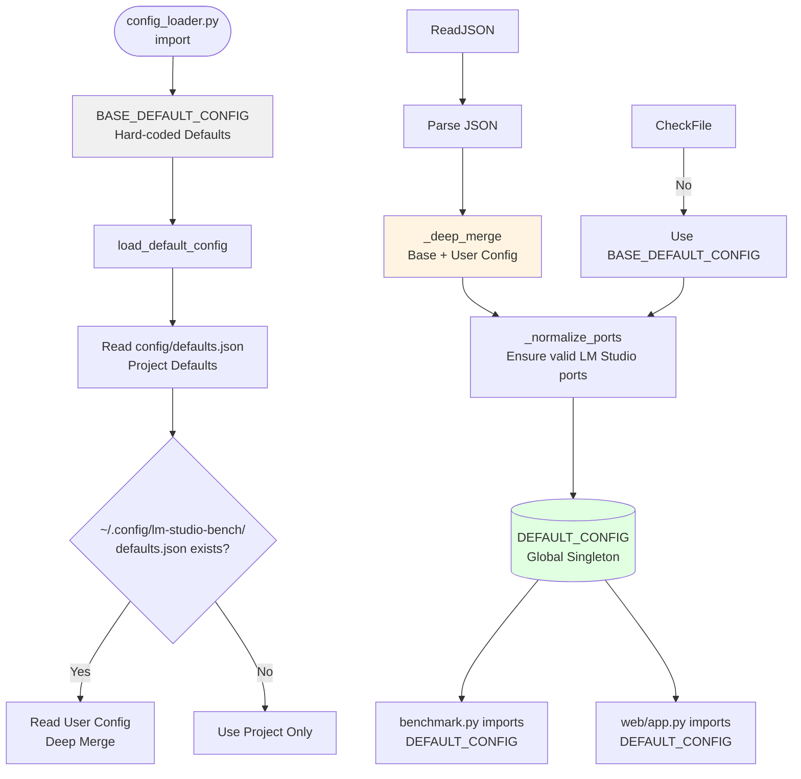

**Configuration Layers:**

| Layer | Source | Priority |
| ----- | ------ | -------- |
| **1. Hard-coded** | `BASE_DEFAULT_CONFIG` in config_loader.py | Lowest |
| **2. User Config** | `~/.config/lm-studio-bench/defaults.json` | Medium |
| **3. Project Config** | `config/defaults.json` | Low |
| **3. CLI Arguments** | argparse in benchmark.py | Highest |

**Merge Strategy:**

- `_deep_merge()` recursively merges nested dictionaries
- User config values override base config
- `None` values in user config are skipped (base value retained)

---

## Configuration Priority

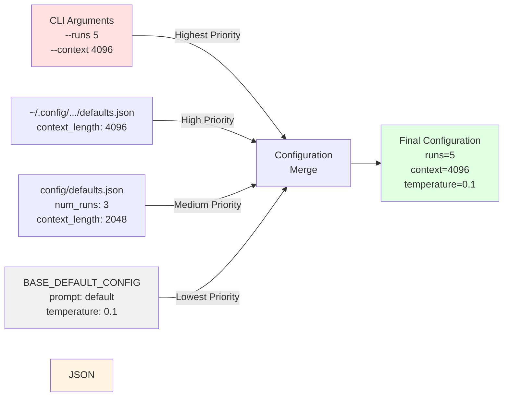

**Example Priority Resolution:**

```python
# BASE_DEFAULT_CONFIG
{
  "num_runs": 3,
  "context_length": 2048,
  "prompt": "Is the sky blue?"
}

# config/defaults.json
{
  "num_runs": 5,
  "prompt": "Explain machine learning"
}

# CLI: ./run.py --runs 1 --context 4096

# FINAL RESULT:
{
  "num_runs": 1,           # ← CLI override
  "context_length": 4096,  # ← CLI override
  "prompt": "Explain..."   # ← JSON override (no CLI arg)
}
```

---

## Benchmark Execution Flow

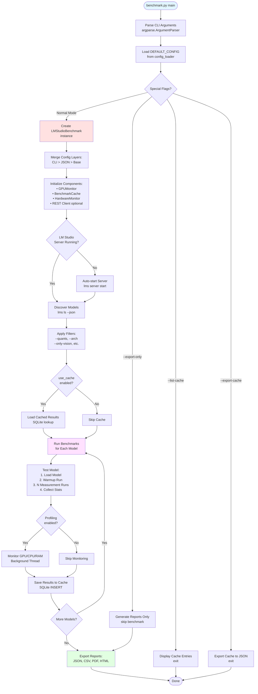

**Key Execution Steps:**

1. **Argument Parsing**: 49 CLI arguments processed by argparse
2. **Configuration Merge**: CLI args override JSON file, JSON overrides base
3. **Component Initialization**: GPU monitor, cache, profiler, REST client
4. **Model Discovery**: `lms ls --json` fetches all installed models
5. **Filtering**: Regex, quantization, architecture, capabilities filters
6. **Cache Lookup**: Skip already-tested models (unless `--retest`)
7. **Benchmark Loop**: For each model: load → warmup → measure (N runs) → unload
8. **Hardware Monitoring**: Optional background thread for GPU/CPU/RAM stats
9. **Cache Storage**: Save results to SQLite for future runs
10. **Report Generation**: Export to JSON/CSV/PDF/HTML

---

## REST API vs SDK Mode

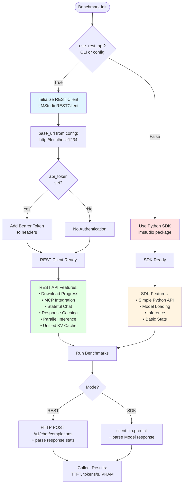

**Mode Comparison:**

| Feature | REST API Mode | SDK/CLI Mode |
| --- | --- | --- |
| **Configuration** | `use_rest_api: true` in config or `--use-rest-api` | Default mode |
| **Endpoint** | HTTP `/v1/chat/completions` | Python SDK `client.llm.predict()` |
| **Stats** | Detailed (TTFT, prompt/completion tokens, tok/s) | Basic (tokens/s only) |
| **Authentication** | Optional Bearer token | Not needed |
| **Parallel Inference** | ✅ `--n-parallel` (continuous batching) | ❌ Sequential only |
| **Stateful Chats** | ✅ response_id tracking | ❌ Stateless |
| **MCP Integration** | ✅ `mcp_integrations` parameter | ❌ Not available |
| **Response Caching** | ✅ MD5 hash caching (10,000x speedup) | ❌ No caching |
| **Download Progress** | ✅ Real-time model loading status | ❌ No progress |

**Configuration Example:**

```json
{
  "lmstudio": {
    "host": "localhost",
    "ports": [1234, 1235],
    "use_rest_api": true,
    "api_token": "lms_your_token_here"
  }
}
```

---

## Component Details

### 1. run.py (Entry Point)

**Responsibilities:**

- Parse `--webapp`/`-w` flag
- Route to web dashboard or benchmark
- Show extended help (`--help`)

**Key Functions:**

- Flag detection: `"--webapp" in sys.argv or "-w" in sys.argv`
- Subprocess launching: `subprocess.call([sys.executable, script] + args)`

---

### 2. config_loader.py (Configuration Manager)

**Responsibilities:**

- Load `config/defaults.json` (project) + `~/.config/lm-studio-bench/defaults.json` (user overrides)
- Merge with `BASE_DEFAULT_CONFIG`
- Provide `DEFAULT_CONFIG` singleton

**Key Functions:**

- `load_default_config()`: Loads and merges config
- `_deep_merge()`: Recursive dict merge
- `_normalize_ports()`: Validates LM Studio ports

**Configuration Fields:**

| Section | Fields |
| --- | --- |
| **Root** | `prompt`, `context_length`, `num_runs` |
| **lmstudio** | `host`, `ports`, `api_token`, `use_rest_api` |
| **inference** | `temperature`, `top_k_sampling`, `top_p_sampling`, `min_p_sampling`, `repeat_penalty`, `max_tokens` |
| **load** | `n_gpu_layers`, `n_batch`, `n_threads`, `flash_attention`, `rope_freq_base`, `rope_freq_scale`, `use_mmap`, `use_mlock`, `kv_cache_quant` |

---

### 3. benchmark.py (Main Engine)

**Responsibilities:**

- Parse 49 CLI arguments
- Manage benchmark lifecycle
- Model discovery and filtering
- Cache management (SQLite)
- Runtime-safe cache schema migration for optional columns
- Hardware monitoring
- Report generation

**Key Classes:**

- `LMStudioBenchmark`: Main orchestrator
- `BenchmarkCache`: SQLite caching
- `GPUMonitor`: GPU detection (NVIDIA/AMD/Intel)
- `HardwareMonitor`: Live profiling (GPU temp, power, VRAM, GTT, CPU, RAM)
- `ModelDiscovery`: Model listing and metadata

**Reliability Behaviors (2026-03):**

- **Runtime cache migration**:
  Missing optional SQLite columns are added automatically at startup and,
  if needed, once again during insert error recovery.
- **Inference retry guard**:
  If LM Studio returns a server error containing `Model unloaded`, the
  benchmark reloads the model and retries inference once.

**CLI Arguments (49 total):**

| Category | Arguments |
| --- | --- |
| **Basic** | `--runs`, `--context`, `--prompt`, `--limit`, `--dev-mode` |
| **Presets** | `--list-presets`, `--preset` |
| **Filter** | `--only-vision`, `--only-tools`, `--quants`, `--arch`, `--params`, `--min-context`, `--max-size`, `--include-models`, `--exclude-models` |
| **Cache** | `--retest`, `--list-cache`, `--export-cache`, `--export-only` |
| **Profiling** | `--enable-profiling`, `--max-temp`, `--max-power`, `--disable-gtt` |
| **Inference** | `--temperature`, `--top-k`, `--top-p`, `--min-p`, `--repeat-penalty`, `--max-tokens` |
| **Load Config** | `--n-gpu-layers`, `--n-batch`, `--n-threads`, `--flash-attention`, `--rope-freq-base`, `--rope-freq-scale`, `--use-mmap`, `--use-mlock`, `--kv-cache-quant` |
| **REST API** | `--use-rest-api`, `--api-token`, `--n-parallel`, `--unified-kv-cache` |
| **Comparison** | `--compare-with`, `--rank-by` |

---

### 4. rest_client.py (REST API Client)

**Responsibilities:**

- HTTP communication with LM Studio v1 API
- Model loading and unloading
- Chat completions with stats
- Download progress tracking
- MCP integration
- Stateful chat history
- Response caching

**Key Classes:**

- `LMStudioRESTClient`: Main REST client
- `ModelInfo`: Model metadata
- `ChatStats`: Response statistics (TTFT, tokens/s, etc.)
- `ModelCapabilities`: Vision, tools detection

**New Features (✨ 2026-02-23):**

1. **Download Progress Tracking**
   - `wait_for_completion()` with progress callbacks
   - Real-time model loading status

2. **MCP Integration**
   - `mcp_integrations` parameter in chat requests
   - Model Context Protocol support

3. **Stateful Chat History**
   - `use_stateful=True` for conversation continuity
   - `last_response_id` tracking

4. **Response Caching**
   - MD5 hash-based caching
   - 10,000x+ speedup for repeated prompts
   - `enable_cache` parameter

**Example Usage:**

```python
client = LMStudioRESTClient(
    base_url="http://localhost:1234",
    api_token="lms_token"
)

# Load model with progress tracking
def on_progress(percent, status):
    print(f"Loading: {percent:.1f}% - {status}")

client.load_model("model@q4", wait_for_completion=True, progress_callback=on_progress)

# Chat with caching
response = client.chat(
    model="model@q4",
    messages=[{"role": "user", "content": "Hello"}],
    enable_cache=True,  # 10,000x speedup for repeated prompts
    use_stateful=True   # Conversation continuity
)
```

---

### 5. tray.py (Linux Tray Controller)

**Responsibilities:**

- Provide Linux AppIndicator tray UI with benchmark controls
- Poll benchmark status and update icon/button state
- Trigger benchmark actions via web API
- Trigger graceful full shutdown via `/api/system/shutdown`

**Key Behaviors:**

- 3-second polling loop via GLib timeout
- Icon states: gray (idle), green (running), yellow (paused), red (error)
- Control state logic:
  - Start enabled in idle and recovery/error state
  - Pause/Stop enabled only while benchmark is active

---

### 6. web/app.py + dashboard.html.jinja (Dashboard Analytics)

**Responsibilities:**

- Aggregate benchmark history for fast visual summaries
- Serve chart-ready payloads via `/api/dashboard/stats`
- Render Home/Results overview charts in the browser with Plotly
- Support quick navigation from ranking tables to model comparison

**Home View (Executive Summary):**

- KPI cards: cached models, avg speed, median (P50), P95, architectures,
  quantizations
- Top 10 bar chart (speed ranking)
- Quantization donut chart (distribution)

**Results View (Exploration):**

- Scatter: `Speed vs VRAM`
- Heatmap: `Model x Quantization -> avg tokens/s`
- Shared data source with table (`/api/results`), so table and charts stay
  consistent

**Quick Compare Flow:**

- Compare actions in Home and Results tables call
  `openComparisonForModel(modelName)`
- Function opens Comparison view, selects the model, then loads full
  historical trends via `/api/comparison/{model_name}`

**Dashboard Summary Fields (`/api/dashboard/stats`):**

- `speed_summary` (`min`, `p50`, `avg`, `p95`, `max`)
- `top_models_extended` (Top 10 models)
- `quantization_distribution`
- `architecture_distribution`
- `efficiency_top`

---

## Data Flow Summary

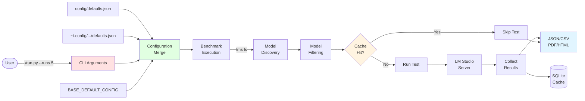

---

## Testing Architecture

LM-Studio-Bench includes a comprehensive test suite with 520+ tests and 51% code coverage to ensure reliability and maintainability.

### Test Organization

```mermaid
graph TB
    Tests[tests/] --> Fixtures[conftest.py<br/>Test Fixtures & Utilities]

    Tests --> BenchmarkTests[test_benchmark.py<br/>55+ tests]
    Tests --> AppTests[test_app.py<br/>23+ tests]
    Tests --> APITests[test_api_endpoints.py<br/>32+ tests]
    Tests --> RestTests[test_rest_client.py<br/>22+ tests]
    Tests --> TrayTests[test_tray.py<br/>26+ tests]
    Tests --> PresetTests[test_preset_manager.py<br/>19+ tests]
    Tests --> ConfigTests[test_config_loader.py<br/>9+ tests]
    Tests --> PathTests[test_user_paths.py<br/>4+ tests]
    Tests --> VersionTests[test_version_checker.py<br/>7+ tests]
    Tests --> MetadataTests[test_scrape_metadata.py<br/>24+ tests]
    Tests --> RunTests[test_run.py<br/>10+ tests]

    BenchmarkTests --> Benchmark[src/benchmark.py]
    AppTests --> WebApp[web/app.py]
    APITests --> WebApp
    RestTests --> RestClient[src/rest_client.py]
    TrayTests --> Tray[src/tray.py]
    PresetTests --> PresetMgr[src/preset_manager.py]
    ConfigTests --> ConfigLoader[src/config_loader.py]
    PathTests --> UserPaths[src/user_paths.py]
    VersionTests --> VersionChecker[src/version_checker.py]
    MetadataTests --> Metadata[tools/scrape_metadata.py]
    RunTests --> RunPy[run.py]

    style Tests fill:#e1f5ff
    style Fixtures fill:#fff4e1
    style BenchmarkTests fill:#ffe1e1
    style AppTests fill:#e1ffe1
```

### Test Coverage by Component

| Component | Test Module | Test Count | Coverage |
| --------- | ----------- | ---------- | -------- |
| Benchmark Engine | `test_benchmark.py` | 55+ | High |
| Web Dashboard | `test_app.py` | 23+ | Medium |
| API Endpoints | `test_api_endpoints.py` | 32+ | High |
| REST Client | `test_rest_client.py` | 22+ | High |
| Linux Tray | `test_tray.py` | 26+ | Medium |
| Preset Manager | `test_preset_manager.py` | 19+ | High |
| Config Loader | `test_config_loader.py` | 9+ | High |
| User Paths | `test_user_paths.py` | 4+ | High |
| Version Checker | `test_version_checker.py` | 7+ | High |
| Metadata Scraping | `test_scrape_metadata.py` | 24+ | Medium |
| Entry Point | `test_run.py` | 10+ | Medium |

### Testing Approach

**Unit Testing:**

- Mock external dependencies (LM Studio API, system commands, file I/O)
- Isolated test cases that can run in any order
- Fast execution (no real API calls or file system operations)
- Use pytest fixtures for common setup and teardown

**Test Fixtures (`conftest.py`):**

- Mock LM Studio client and server responses
- Temporary directories for file operations
- Mock system commands (nvidia-smi, rocm-smi, etc.)
- Sample configuration and model data

**Continuous Integration:**

- GitHub Actions runs full test suite on every PR
- Code quality checks (flake8, pylint)
- Security scans (Bandit, CodeQL, Snyk)
- Test results reported in PR status checks

**Running Tests:**

```bash
# Run all tests
pytest

# Run with verbose output
pytest -v

# Run specific module
pytest tests/test_benchmark.py

# Run with coverage report
pytest --cov=src --cov=web --cov-report=html

# Run tests matching a pattern
pytest -k "test_gpu_detection"
```

---

## See Also

- [Configuration Reference](CONFIGURATION.md) - All CLI arguments and config file options
- [REST API Features](REST_API_FEATURES.md) - REST API integration details
- [Quickstart Guide](QUICKSTART.md) - Get started in 5 minutes
